# Devflow User Manual

A practical guide to the Devflow framework — what it is, why it exists, how to install it, and how to get the most out of it.

---

## Table of Contents

1. [Why Devflow Exists](#1-why-devflow-exists)
2. [Core Concepts](#2-core-concepts)
3. [Framework Structure](#3-framework-structure)
4. [Architecture Overview](#4-architecture-overview)
5. [The Nine Pipelines](#5-the-nine-pipelines)
6. [Pipeline Flow Diagrams](#6-pipeline-flow-diagrams)
7. [Usage Examples](#7-usage-examples)
8. [Installation — Claude Code](#8-installation--claude-code)
9. [Installation — Other AI Tools](#9-installation--other-ai-tools)
10. [Creating New Skills and Agents](#10-creating-new-skills-and-agents)
11. [Limitations](#11-limitations)
12. [Quick Reference](#12-quick-reference)

---

## 1. Why Devflow Exists

### The Problem

When you ask an AI assistant to help with software development, the default behavior is to start doing things immediately — writing code, proposing solutions, reviewing diffs — without first asking: *Is this the right approach? Have we understood the problem? What could go wrong?*

This produces several recurring failure modes:

- **Code written before requirements are understood** — builds the wrong thing
- **Fixes applied before the root cause is confirmed** — masks the real problem
- **Tests written after implementation** — proves nothing, catches nothing
- **Reviews that are rubber stamps** — performative agreement, no technical rigor
- **Work claimed complete without verification** — false confidence

Each of these failures is not a capability problem. The AI can do better. The problem is *discipline* — there is no structure forcing the right sequence of steps.

### The Solution

Devflow is a framework of **skills** and **worker agents** for Claude Code that enforces disciplined, sequenced software development workflows. It acts as a **router and gatekeeper**: before any code is written, any plan is made, or any review is given, the right worker for the job is selected and announced.

The result is that every task follows a proven pipeline — requirements before design, design before planning, planning before implementation, tests before merge, verification before completion claims.

### Who It Is For

- **Solo developers** using Claude Code who want consistent, high-quality AI assistance across sessions
- **Teams** who want to enforce shared development discipline through AI tooling
- **Anyone who has been burned** by AI assistants confidently doing the wrong thing

---

## 2. Core Concepts

### Skills

A **skill** is a reusable process guide stored in `~/.claude/skills/`. It is invoked via a slash command (e.g., `/using-devflow`, `/test-driven-development`). Skills define *how* to approach a category of work — the steps, the rules, the checks.

Skills are loaded into Claude's context when invoked. They constrain and guide behavior for that session. Skills have no `model:` field — they are model-agnostic process guides.

### Agents

An **agent** is a worker definition stored in `~/.claude/agents/`. Each agent has a focused role, strict boundaries, a defined output format, and a model chosen for its cognitive tier. Agents are dispatched by skills to do specific work: plan, implement, test, review, document.

An agent knows what it **does** and — equally important — what it **does not** do. A `test-engineer` writes tests; it does not change production code. A `code-reviewer` critiques; it does not rewrite.

### The Router

`using-devflow` is the master routing skill. It must be invoked at the start of every task. It:

1. Reads the task description
2. Selects the correct **pipeline** (ordered sequence of workers)
3. Announces the pipeline and the first active agent
4. Enforces that no work begins before routing is complete

### Pipelines

A **pipeline** is an ordered sequence of workers matched to a task type. There are nine pipelines covering the full software development lifecycle:

```
0  Requirements gathering    → understand the problem first
1  Spike / POC investigation → validate before committing
2  Unfamiliar API / library  → research gate before building
3  New feature               → plan → build → test → review → verify
4  Bug fix                   → reproduce → test → fix → review → verify
5  Refactor                  → plan → simplify → review → verify
6  Test-only                 → add coverage without touching production
7  Review-only               → evaluate without implementing
8  Docs-only                 → document what shipped
```

### Worker Self-Identification

Every agent response begins with a three-line header:

```
Active agent: <agent name>
Purpose: <one sentence>
Scope: <what is in scope / out of scope>
```

And ends with:

```
Worker compliance: followed <agent-name> format
```

This makes compliance visible and auditable. You always know which worker is active and what it is responsible for.

---

## 3. Framework Structure

### Skills Catalog (21 skills)

| Category | Skill | Purpose |
|---|---|---|
| **Routing** | `using-devflow` | Master router — selects pipeline before any work begins |
| **Requirements** | `interview` | Structured questioning to produce a written spec |
| | `brainstorming` | Turns a spec into a concrete design through dialogue |
| **Investigation** | `spike-executor` | Orchestrates full spike/POC lifecycle |
| | `hypothesis-validator` | Minimal experiment to test one specific assumption |
| | `poc-retrospective` | Captures spike decision, learnings, carry-forwards |
| | `find-bugs` | Security and quality audit of branch changes |
| **Planning** | `writing-plans` | Bite-sized, TDD-anchored implementation plans |
| | `executing-plans` | Runs a plan step-by-step with review checkpoints |
| **Implementation** | `test-driven-development` | RED-GREEN-REFACTOR cycle enforcement |
| | `code-simplifier` | Orchestrates code cleanup for clarity while preserving behavior |
| | `subagent-driven-development` | Parallel plan execution via independent subagents |
| | `dispatching-parallel-agents` | Parallelizes independent tasks across subagents |
| | `using-git-worktrees` | Isolated git worktree before implementation begins |
| **Review** | `requesting-code-review` | Verifies work meets requirements before merging |
| | `receiving-code-review` | Technical rigor when processing review feedback |
| | `verification-before-completion` | Evidence-based check before any completion claim |
| **Completion** | `finishing-a-development-branch` | Guides branch to merge, PR, or cleanup |
| **Continuity** | `session-continuity` | Snapshots work state for multi-session continuity |
| **Meta** | `writing-skills` | TDD-based approach to creating and testing new skills |
| **Debugging** | `systematic-debugging` | Root-cause investigation before proposing fixes |

### Agents Catalog (14 agents)

| Agent | Role | Model |
|---|---|---|
| `task-planner` | Translates tasks into minimal, executable implementation plans | Opus |
| `context-mapper` | Traces dependency blast area and writes a context map for downstream workers | Haiku |
| `feature-implementer` | Implements one scoped plan step with minimal diff | Sonnet |
| `test-engineer` | Writes/updates tests, regression coverage, and edge cases | Sonnet |
| `code-reviewer` | Critiques correctness, regressions, standards, and test adequacy | Sonnet |
| `acceptance-checker` | Maps implementation to acceptance criteria with evidence | Sonnet |
| `docs-updater` | Keeps documentation aligned with recent code changes | Haiku |
| `api-researcher` | Researches external APIs/libraries and produces implementation guidance | Sonnet |
| `bug-repro-triager` | Produces repro steps, root cause hypotheses, and investigation plans | Sonnet |
| `code-simplification` | Simplifies recently modified code while preserving exact behavior | Sonnet |
| `research` | General-purpose technical research for any domain, library, or concept | Sonnet |
| `spike-investigator` | Hands-on throwaway experimentation to validate a hypothesis | Sonnet |
| `technology-selector` | Evaluates technology options and produces a single recommendation with trade-offs | Opus |
| `scope-estimator` | Rough effort and complexity sizing before writing a full plan | Sonnet |

**Model tiers:** Opus for high-stakes reasoning (planning, architecture decisions); Haiku for mechanical tasks (dependency mapping, doc sync); Sonnet for code reasoning, analysis, and writing.

---

## 4. Architecture Overview

### How a Task Flows Through Devflow

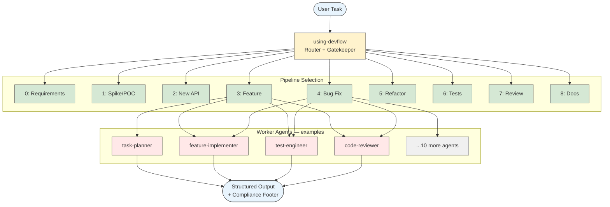

### Pipeline Lifecycle

Pipelines follow the natural lifecycle of software development work:

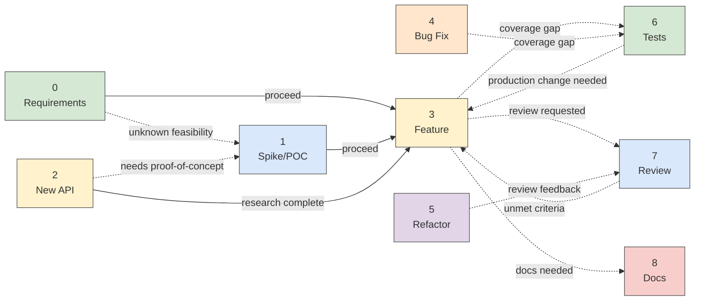

---

## 5. The Nine Pipelines

Each pipeline maps a task type to an ordered sequence of workers. Workers are selected, announced, and executed in sequence. The router always makes the pipeline visible before work begins.

---

### Pipeline 0 — Requirements Gathering

**Use when:** The task is vague, requirements are not written down, or you cannot determine which implementation pipeline applies.

**Default pipeline:**
```
interview → brainstorming → scope-estimator → writing-plans
```

**Key rules:**
- No code is written in this pipeline — the output is a written spec and an implementation plan
- `interview` extracts requirements one question at a time; `brainstorming` turns them into a concrete design
- `scope-estimator` gates the proceed decision — if the estimate is XL or confidence is Low, split the work before opening a plan
- Do not start `writing-plans` until the design is agreed and the spec document is saved

**Useful variants:**
- Skip `interview` if requirements are partially specified — start directly with `brainstorming`
- Insert `spike-executor` between `brainstorming` and `scope-estimator` when feasibility of the proposed design is unknown

**Exit transitions:**
- Scope is manageable → `writing-plans`, then route to Pipeline 3 or 4
- Key assumption unvalidated → Pipeline 1 (Spike/POC)
- Scope too large → split into multiple plans, each routed independently

---

### Pipeline 1 — Spike / POC Investigation

**Use when:** A technical idea needs feasibility validation before committing to a plan, or a key implementation assumption is unvalidated.

**Default pipeline:**
```
research → spike-investigator → poc-retrospective
```

**Key rules:**
- `spike-investigator` works in throwaway mode — no TDD, no production standards apply
- `poc-retrospective` is **mandatory** — never close a spike without capturing the decision, evidence, and carry-forwards
- When the spike produces a **Proceed** decision, start production implementation in a **new session** — read the retrospective to orient; do not carry spike-mode context forward

**Useful variants:**
- Replace `spike-investigator` with `hypothesis-validator` when the question is narrow and one specific assumption needs a designed experiment
- Insert `technology-selector` after `research` when the investigation includes a technology choice between named options
- Prepend `using-git-worktrees` before `spike-investigator` when the spike produces code artifacts — keeps throwaway code on an isolated branch

**Exit transitions:**
- Proceed → `writing-plans` in a new session, starting from the retrospective document
- Pivot → new spike with refined hypothesis
- Abandon → `poc-retrospective` closes the record; no further work

---

### Pipeline 2 — Unfamiliar API / Library / Framework

**Use when:** Integrating a library, framework, or external API not previously used in this project, or when version differences may affect the approach.

**Default pipeline:**
```
api-researcher
```

This pipeline is a **research gate only** — it produces findings, not implementation. No code is written here.

**Key rules:**
- `api-researcher` must produce actionable findings before any planning begins — do not proceed while critical behavior is still unknown
- If the findings are clear and the approach is viable, carry them explicitly into `task-planner` in Pipeline 3

**Useful variants:**
- Prepend `technology-selector` when the library or framework has not yet been chosen and two or more options are under consideration

**Exit transitions:**
- Findings are clear and approach is viable → Pipeline 3 (Feature build), carrying research findings into `task-planner`
- Findings reveal an unknown that requires hands-on validation → Pipeline 1 (Spike/POC) to resolve before planning
- Findings reveal the integration is fundamentally incompatible → Pipeline 0 (Requirements) to rethink the design

---

### Pipeline 3 — New Feature / Behavior Change

**Use when:** Adding new user-visible behavior, changing existing behavior, or extending a public API or interface.

**Default pipeline:**
```
task-planner → feature-implementer → test-engineer → code-reviewer → acceptance-checker
```

**Key rules:**
- `task-planner` defines done criteria before `feature-implementer` starts — no implementation without a plan
- `test-engineer` writes tests before the branch is merged, not after
- `acceptance-checker` maps evidence to stated criteria — it does not invent missing evidence
- If arriving from Pipeline 2 and `task-planner` finds the research findings incomplete for a critical edge case, return to Pipeline 2 for a second research pass before continuing

**Useful variants:**
- Prepend `scope-estimator` when scope is unclear or the feature touches many areas
- Prepend `using-git-worktrees` before `feature-implementer` to isolate work on a feature branch
- Insert `context-mapper` after `task-planner` when the codebase is large or the change touches a shared module — maps reverse dependencies and existing test coverage so downstream workers don't scan the full codebase
- Append `docs-updater` when public behavior, API, configuration, or migration notes change

**Exit transitions:**
- `code-reviewer` returns feedback → `receiving-code-review`, then re-run `code-reviewer`, then proceed to `acceptance-checker`
- `acceptance-checker` finds missing implementation → return to `feature-implementer`, re-run `test-engineer` and `code-reviewer` before re-checking
- `acceptance-checker` finds missing test coverage → return to `test-engineer`, re-run `code-reviewer` before re-checking
- All acceptance criteria met → `finishing-a-development-branch`

---

### Pipeline 4 — Bug Fix / Runtime Failure

**Use when:** A reported defect or runtime failure needs investigation and a targeted fix.

**Default pipeline:**
```
bug-repro-triager → test-engineer → feature-implementer → code-reviewer → acceptance-checker
```

**Key rules:**
- Reproduce first — no fix is proposed or applied before the failure is confirmed
- `test-engineer` writes a **failing regression test** before `feature-implementer` applies the fix
- `feature-implementer` applies the minimal fix only — no unrelated cleanup or refactoring

**Useful variants:**
- Skip `bug-repro-triager` only if a minimal reproduction and root cause are already confirmed with evidence
- Prepend `using-git-worktrees` before `feature-implementer` to isolate the fix on a branch
- Use `dispatching-parallel-agents` when 3 or more independent failures exist across different subsystems
- Insert `context-mapper` after `bug-repro-triager` when the codebase is large or the failure implicates a shared module

**Exit transitions:** Same as Pipeline 3 — code-reviewer loop, acceptance-checker loop, then `finishing-a-development-branch`.

> **Note:** Pipelines 3 and 4 share identical completion rules. Any change to the Transition or completion behavior of one applies to the other.

---

### Pipeline 5 — Refactor / Simplification

**Use when:** Code structure needs improvement without changing external behavior, or a scheduled technical debt item is being addressed.

**Default pipeline:**
```
task-planner → code-simplifier → code-reviewer → acceptance-checker
```

**Key rules:**
- `code-simplifier` must not alter external behavior or broaden scope beyond the refactor target
- `acceptance-checker` confirms behavior is preserved — not improved or extended
- If behavior-preservation risk is non-trivial and existing coverage is insufficient, add `test-engineer` before `code-simplifier`

**Useful variants:**
- Prepend `test-engineer` when existing test coverage is insufficient to confirm behavior preservation
- Prepend `using-git-worktrees` before `code-simplifier` to isolate refactor work on a branch
- Insert `context-mapper` after `task-planner` when the refactor targets a shared module — maps reverse dependents before any changes begin

**Exit transitions:**
- `code-reviewer` returns feedback → `receiving-code-review`, re-run `code-reviewer`, then proceed to `acceptance-checker`
- `acceptance-checker` finds altered behavior → return to `code-simplifier`, re-run `code-reviewer` before re-checking
- `acceptance-checker` finds insufficient test coverage → return to `test-engineer`, re-run `code-reviewer` before re-checking
- All acceptance criteria met → `finishing-a-development-branch`

---

### Pipeline 6 — Test-Only

**Use when:** Coverage gaps need to be filled without changing production code, or regression tests need to be added after a bug fix in a separate pass.

**Default pipeline:**
```
test-engineer → code-reviewer
```

**Key rules:**
- `test-engineer` must not modify production code unless absolutely necessary for testability — and must explain why if it does
- `code-reviewer` is required for complex or shared test infrastructure changes; may be skipped for trivial isolated tests

**Useful variants:**
- Add `acceptance-checker` if tests must map to formal acceptance criteria
- Prepend `using-git-worktrees` before `test-engineer` to isolate test changes on a branch
- Insert `context-mapper` before `test-engineer` when the codebase is large — maps existing test files and coverage gaps so `test-engineer` targets the right files

**Exit transitions:**
- `code-reviewer` returns feedback → `receiving-code-review`, re-run `code-reviewer` before closing
- Coverage gaps remain after review → return to `test-engineer` for another pass
- Coverage gaps require production code changes → route to Pipeline 3 (new feature) or Pipeline 4 (bug fix)
- All coverage goals met → `finishing-a-development-branch`

---

### Pipeline 7 — Review-Only

**Use when:** An explicit review of existing code or a pull request is requested, with no implementation change intended.

**Default pipeline:**
```
code-reviewer
```

**Key rules:**
- State the review scope before `code-reviewer` begins
- `code-reviewer` critiques — it does not rewrite unless explicitly asked
- If `acceptance-checker` finds unmet criteria, Pipeline 7 does not implement — route to Pipeline 3 or 4 to address the gaps, then return to Pipeline 7 for a final review pass

**Useful variants:**
- Add `acceptance-checker` if formal acceptance criteria need to be verified against the diff
- Add `test-engineer` if review surfaces missing or insufficient coverage — prepend `using-git-worktrees` since test-engineer produces real file changes
- Add `find-bugs` when the review is security-focused or the diff touches auth, input handling, or external calls
- Insert `context-mapper` before `code-reviewer` when reviewing changes to shared modules — the Reverse Dependents list directly informs regression risk assessment

**Exit transitions:**
- `code-reviewer` returns feedback → `receiving-code-review`, re-run `code-reviewer` to confirm resolution
- `acceptance-checker` finds unmet criteria → Pipeline 3 or 4, then return to Pipeline 7 for final review
- `code-reviewer` returns no blocking issues → `finishing-a-development-branch`

---

### Pipeline 8 — Docs-Only

**Use when:** Documentation needs updating after a code change, or a README, changelog, or API reference is out of date.

**Default pipeline:**
```
docs-updater
```

**Key rules:**
- `docs-updater` must not invent undocumented behavior — document only what shipped
- Scope docs updates to the changes that actually landed

**Useful variants:**
- Add `code-reviewer` if docs describe technically complex or risky behavior that requires accuracy verification

**Exit transitions:**
- `code-reviewer` returns feedback on doc accuracy → `receiving-code-review`, re-run `code-reviewer` to confirm
- Docs complete and no blocking issues → `finishing-a-development-branch`

---

## 6. Pipeline Flow Diagrams

### Pipeline 0 — Requirements Gathering

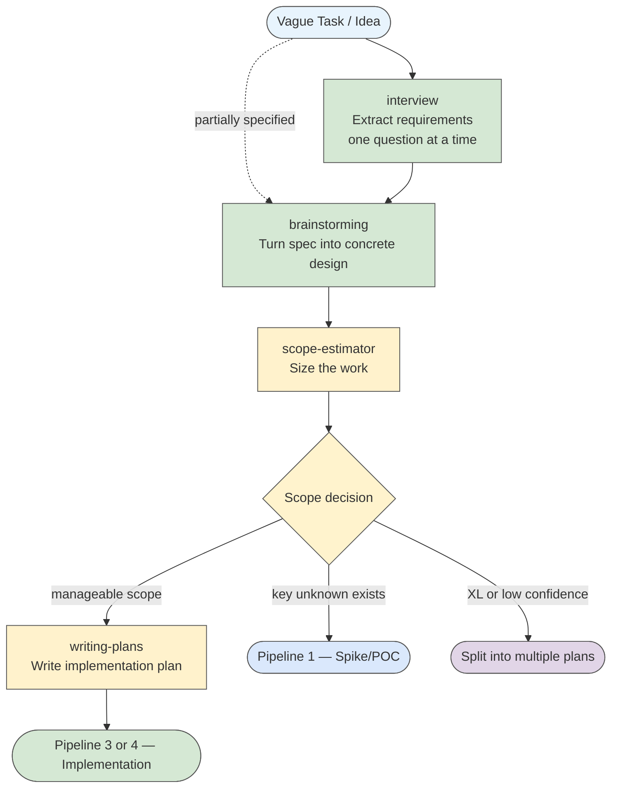

---

### Pipeline 1 — Spike / POC Investigation

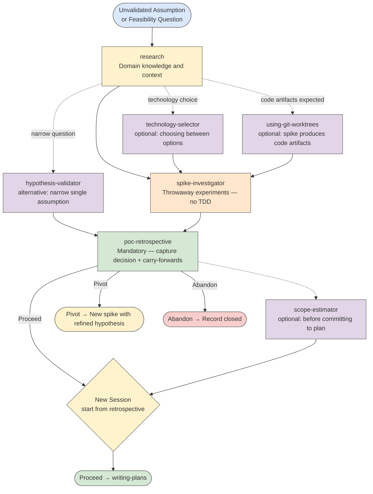

---

### Pipeline 2 — Unfamiliar API / Library

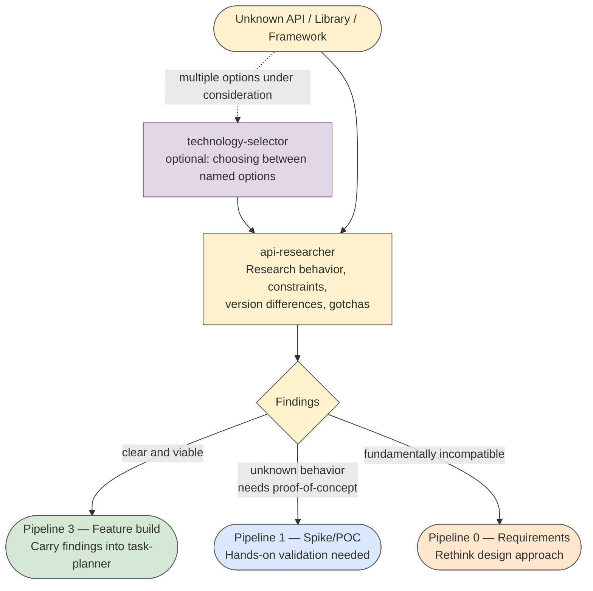

---

### Pipeline 3 — New Feature / Behavior Change

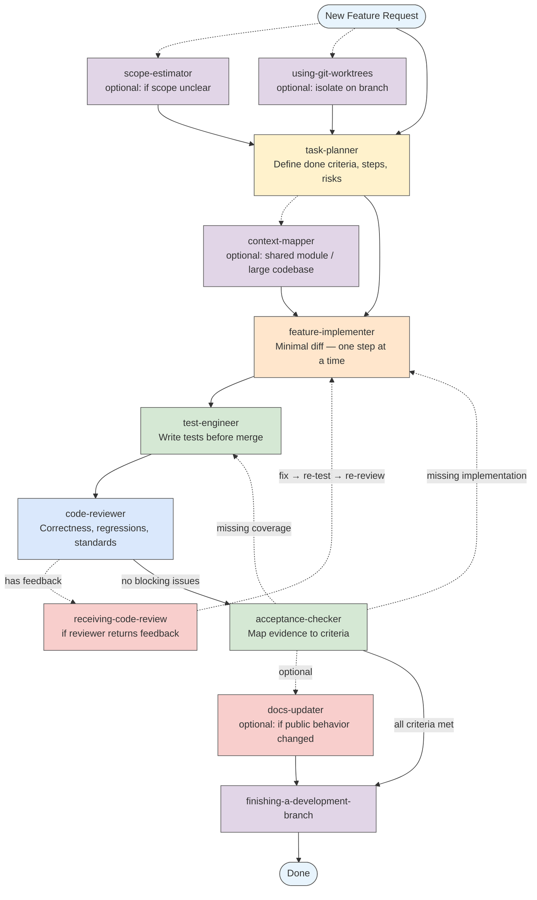

---

### Pipeline 4 — Bug Fix / Runtime Failure

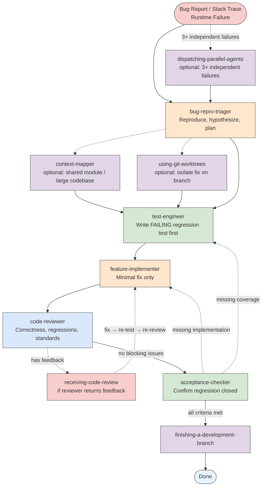

---

### Pipeline 5 — Refactor / Simplification

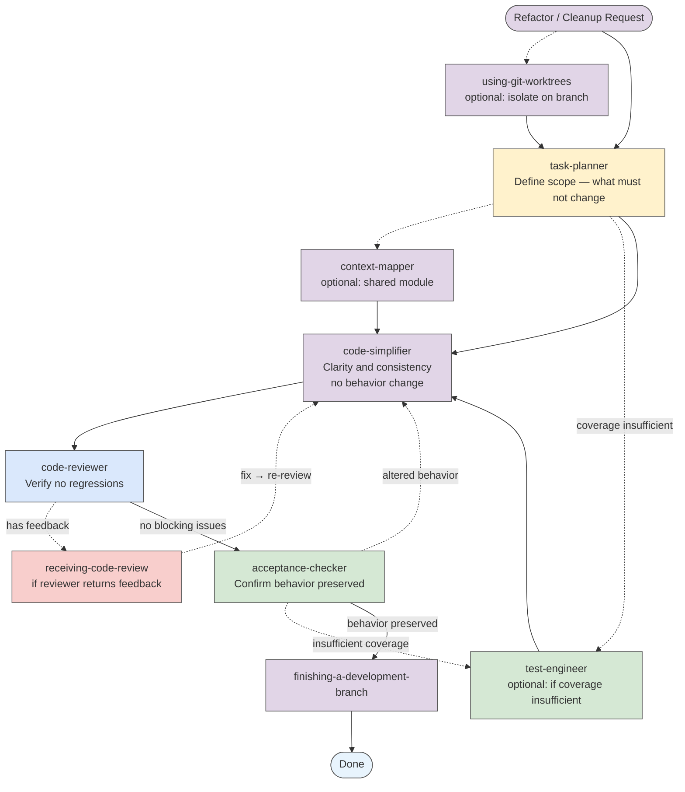

---

### Pipeline 6 — Test-Only

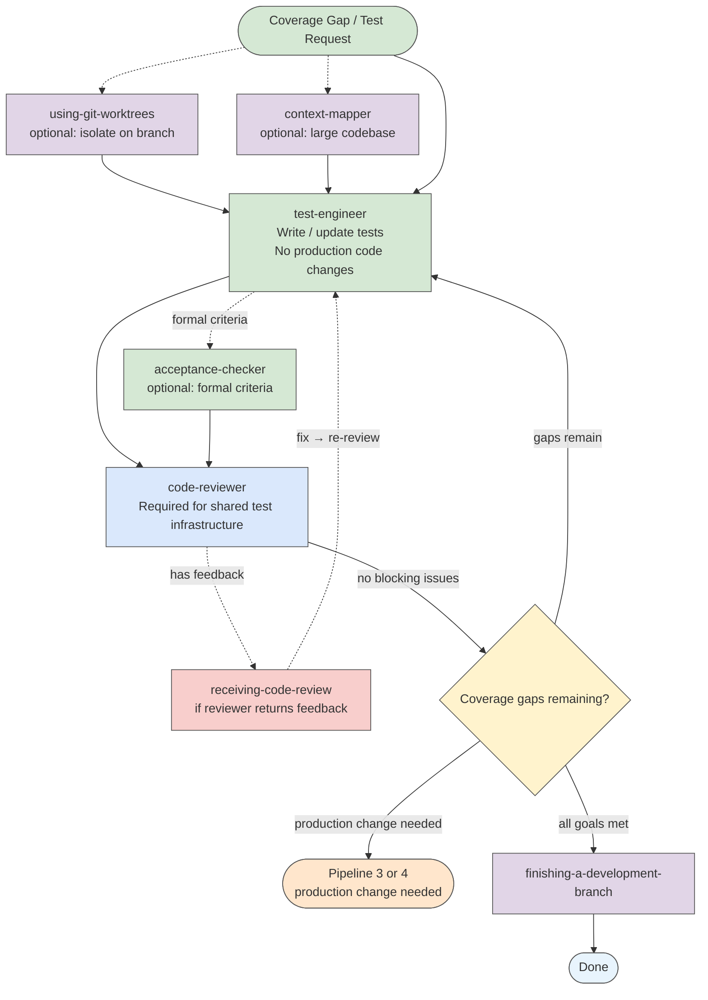

---

### Pipeline 7 — Review-Only

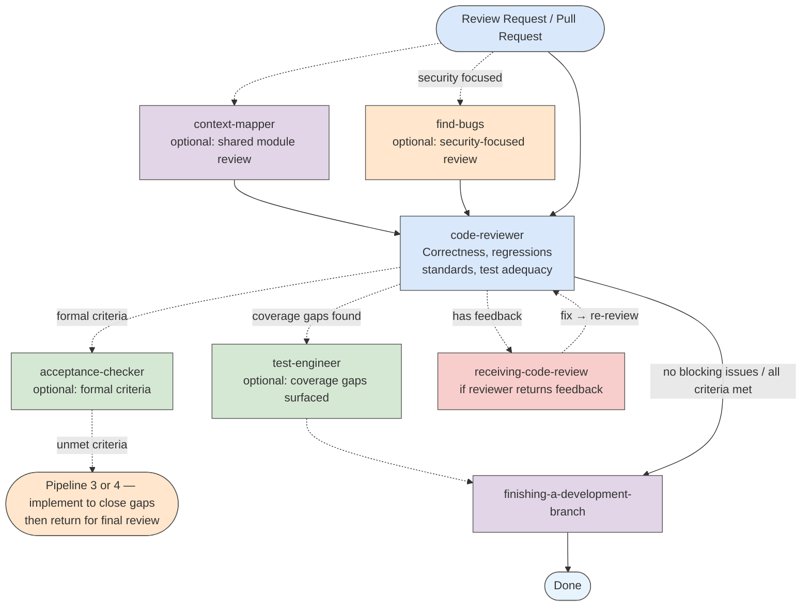

---

### Pipeline 8 — Docs-Only

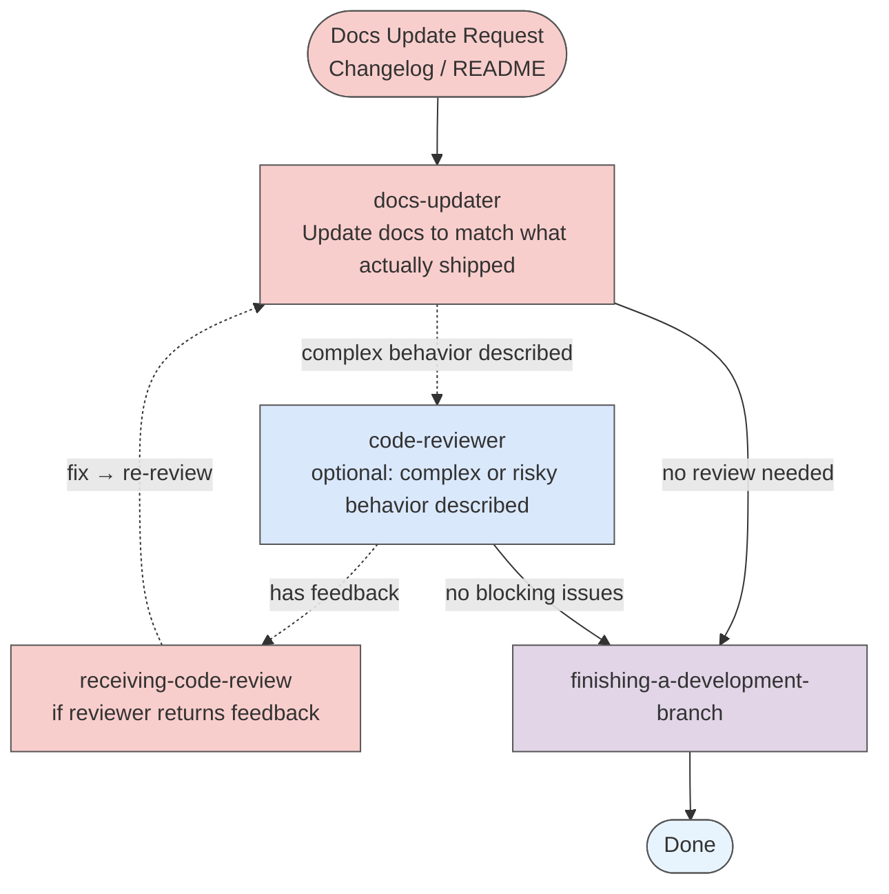

---

## 7. Usage Examples

### Example 1: "I have an idea for a new feature"

The task is vague — requirements are not written down.

**What Devflow does:**

```
Selected worker agents: interview → brainstorming → scope-estimator → writing-plans
Reason: requirements undefined — spec and design must be established before any planning or coding (pipeline 0)
Current agent: interview
```

`interview` asks questions one at a time to produce a written spec. `brainstorming` turns it into a concrete design. `scope-estimator` checks if the scope is manageable before opening a plan.

---

### Example 2: "Can we use WebSockets for real-time updates before we commit to it?"

A feasibility question before committing to a technical approach.

**What Devflow does:**

```
Selected worker agents: research → spike-investigator → poc-retrospective
Reason: unvalidated feasibility assumption — validate before committing to a plan (pipeline 1)
Current agent: research
```

`research` gathers context on WebSocket behavior, browser support, and integration patterns. `spike-investigator` runs a throwaway proof-of-concept. `poc-retrospective` captures the decision (Proceed / Pivot / Abandon) and carry-forwards for the production implementation.

**Critical discipline enforced:** Production implementation starts in a **new session** from the retrospective — spike-mode context is not carried forward.

---

### Example 3: "We're integrating Stripe for the first time"

Unfamiliar external API — research before building.

**What Devflow does:**

```
Selected worker agents: api-researcher
Reason: unfamiliar external API — research gate before planning (pipeline 2)
Current agent: api-researcher
```

`api-researcher` investigates Stripe's relevant endpoints, authentication patterns, webhook behavior, and version-specific gotchas. When findings are clear, they are carried explicitly into `task-planner` at the start of Pipeline 3 — no implementation begins until the research gate is passed.

---

### Example 4: "Add pagination to the users list"

A well-understood feature request — plan, build, test, verify.

**What Devflow does:**

```
Selected worker agents: task-planner → feature-implementer → test-engineer → code-reviewer → acceptance-checker
Reason: new behavior change with regression risk (pipeline 3)
Current agent: task-planner
```

`task-planner` defines done criteria, identifies files likely to change, and writes the implementation steps. `feature-implementer` makes the minimal diff. `test-engineer` covers the new behavior and edge cases. `code-reviewer` checks for regressions. `acceptance-checker` maps evidence to the stated criteria before the branch is closed.

---

### Example 5: "Fix this stack trace"

A bug report with a stack trace.

**What Devflow does:**

```
Selected worker agents: bug-repro-triager → test-engineer → feature-implementer → code-reviewer → acceptance-checker
Reason: runtime failure — reproduce and regression-cover before fixing (pipeline 4)
Current agent: bug-repro-triager
```

`bug-repro-triager` confirms the reproduction steps and root cause hypothesis. `test-engineer` writes a failing regression test. `feature-implementer` applies the minimal fix. `code-reviewer` checks correctness. `acceptance-checker` confirms the regression is closed.

**Critical discipline enforced:** The fix is never applied before the failure is reproduced and a failing test is written.

---

### Example 6: "This module has gotten hard to read — clean it up without changing behavior"

Refactor request — structure improvement, no behavior change.

**What Devflow does:**

```
Selected worker agents: task-planner → code-simplifier → code-reviewer → acceptance-checker
Reason: code structure improvement without behavior change (pipeline 5)
Current agent: task-planner
```

`task-planner` defines what "clean" means and what must not change. `code-simplifier` applies targeted clarity improvements. `acceptance-checker` confirms that external behavior is preserved — not improved or extended.

---

### Example 7: "We merged the auth fix but never added regression tests"

Retroactive test coverage for a landed fix.

**What Devflow does:**

```
Selected worker agents: test-engineer → code-reviewer
Reason: explicit test-only request — no production code change intended (pipeline 6)
Current agent: test-engineer
```

`test-engineer` writes regression tests scoped to the auth fix. `code-reviewer` checks test quality and ensures they actually cover the failure path. No production code is touched.

---

### Example 8: "Can you review these recent changes?"

Explicit review request — evaluation only, no implementation.

**What Devflow does:**

```
Selected worker agents: code-reviewer
Reason: explicit review request, no implementation intended (pipeline 7)
Current agent: code-reviewer
```

`code-reviewer` checks correctness, regressions, standards, and test adequacy. If feedback requires fixes, `receiving-code-review` processes it and `code-reviewer` re-runs to confirm resolution before closing.

---

### Example 9: "Update the README to reflect the new config options we shipped"

Documentation update scoped to a recent code change.

**What Devflow does:**

```
Selected worker agents: docs-updater
Reason: documentation update scoped to recent code changes — no implementation intended (pipeline 8)
Current agent: docs-updater
```

`docs-updater` reads the recent changes and updates only the documentation affected by them — no broad rewrites, no invented behavior.

---

### Example 10: "Three test files are failing in unrelated subsystems"

Multiple independent failures — parallel dispatch.

**What Devflow does:**

```
Selected worker agents: dispatching-parallel-agents → bug-repro-triager (×3) → test-engineer → feature-implementer → code-reviewer
Reason: 3 independent failures in different subsystems — parallel dispatch saves time (pipeline 4 + parallel variant)
Current agent: dispatching-parallel-agents
```

One `bug-repro-triager` per failure domain runs simultaneously instead of sequentially. Fixes are reviewed for conflicts before integration.

---

## 8. Installation — Claude Code

### Prerequisites

- [Claude Code](https://docs.anthropic.com/en/docs/claude-code) installed and configured
- Bash or a compatible shell

### Step 1: Copy Skills

```bash
cp -r skills/* ~/.claude/skills/
```

### Step 2: Copy Agents

```bash
cp -r agents/* ~/.claude/agents/
```

### Step 3: Configure the Router

Add the routing instruction to your `~/.claude/CLAUDE.md` (create it if it does not exist):

```markdown
For EVERY task — no exceptions — invoke the `using-devflow` skill before doing any work.
```

This single line is what activates Devflow. Without it, Claude Code will not automatically apply the router.

### Step 4: Verify

Start a new Claude Code session and give a task. You should see the routing announcement before any work begins:

```
Selected worker agents: ...
Reason: ...
Current agent: ...
```

If you do not see this, check that `~/.claude/CLAUDE.md` contains the routing instruction and that the skills directory is correctly populated.

### Optional: Project-Specific Configuration

Add a `CLAUDE.md` in any project directory to enable Devflow for that project specifically:

```markdown
For EVERY task — no exceptions — invoke the `using-devflow` skill before doing any work.
```

This scopes Devflow to that project without affecting global behavior.

---

## 9. Installation — Other AI Tools

Devflow's pipeline discipline and worker roles are model-agnostic. The routing logic, structured output formats, and nine-pipeline structure all transfer to any AI coding assistant. What differs is how each tool loads instructions and whether it supports automatic agent dispatch.

### What Transfers and What Doesn't

| Feature | Claude Code | Other AI tools |
|---|---|---|
| Pipeline structure and discipline | ✅ Native | ✅ Fully portable |
| Worker self-identification headers | ✅ Native | ✅ Fully portable |
| Structured output formats | ✅ Native | ✅ Fully portable |
| Routing logic (`using-devflow`) | ✅ Auto-loaded via `CLAUDE.md` | ⚠️ Must be loaded via tool-specific mechanism |
| Agent files (`.agent.md`) | ✅ Auto-dispatched | ❌ Must be inlined or pasted manually |
| Slash commands (`/skill-name`) | ✅ Native | ❌ Manual invocation only |
| Per-agent model selection | ✅ Enforced via `model:` frontmatter | ❌ Single model for all roles |
| Per-agent tool restrictions | ✅ Enforced via `tools:` frontmatter | ❌ All tools available to all roles |

### Step 1: Load the Router

The routing skill (`using-devflow/SKILL.md`) must be loaded into the AI's context at the start of every session. Each tool has its own mechanism:

| Tool | Instruction file / mechanism |
|---|---|
| **Cursor** | `.cursor/rules/devflow.mdc` or `.cursorrules` |
| **GitHub Copilot** | `.github/copilot-instructions.md` |
| **Windsurf** | `.windsurfrules` |
| **Aider** | `--system-prompt devflow-system.md` flag or `.aider.system.md` |
| **Continue** | `systemMessage` field in `.continue/config.json` |
| **Any tool with a system prompt** | Paste `using-devflow/SKILL.md` content into the system prompt field |

Copy the full content of `devflow/skills/using-devflow/SKILL.md` into the appropriate file for your tool. This gives the AI the routing logic, pipeline definitions, and worker discipline rules — without needing slash commands.

### Step 2: Make Agent Definitions Available

Without native agent dispatch, worker definitions must reach the AI another way. Choose one of two strategies based on your workflow:

---

**Strategy A — Full Inline (simpler, higher token cost)**

Append all agent definitions to the same instruction file as the router. The AI always has all worker roles in context and can switch between them automatically when the pipeline advances.

Create a single combined file:

```
devflow-system.md
├── [content of using-devflow/SKILL.md]
├── --- WORKER DEFINITIONS ---
├── [content of agents/task-planner.agent.md]
├── [content of agents/feature-implementer.agent.md]
├── [content of agents/test-engineer.agent.md]
├── [content of agents/code-reviewer.agent.md]
├── [content of agents/acceptance-checker.agent.md]
└── ... remaining agents
```

Load this combined file via your tool's instruction mechanism. Remove the YAML frontmatter from each agent file before merging — the `name:`, `model:`, `tools:`, and `framework:` fields are Claude Code-specific and will just add noise.

**Pros:** Zero manual work per session. The AI always knows all roles.
**Cons:** Significant token cost on every request. May exceed context limits for smaller models.

---

**Strategy B — On-Demand Pasting (leaner, more deliberate)**

Keep `using-devflow/SKILL.md` as the only always-loaded content. Keep individual agent files as reference documents. When a pipeline step begins, paste the relevant agent's content directly into the chat.

```
You are now acting as task-planner. Follow these rules exactly:

[paste content of agents/task-planner.agent.md here, without YAML frontmatter]
```

When the pipeline transitions to the next worker:

```
task-planner is complete. You are now acting as feature-implementer.

[paste content of agents/feature-implementer.agent.md]
```

**Pros:** Lean context — only the active worker is loaded. Works well within tight token budgets.
**Cons:** Requires manual pasting at each pipeline transition. More deliberate but also more visible.

---

### Step 3: Activate a Pipeline

Without slash commands, trigger the router explicitly at the start of every task:

```
New task: [describe the task here]

Please apply using-devflow now: select the correct pipeline, announce the worker sequence,
and begin with the first worker.
```

The AI will output the routing announcement using the rules it loaded in Step 1:

```
Selected worker agents: task-planner → feature-implementer → test-engineer → code-reviewer → acceptance-checker
Reason: new behavior change with regression risk (pipeline 3)
Current agent: task-planner
```

### Step 4: Advance Through the Pipeline

At each transition point, prompt the AI to move to the next worker:

```
task-planner output looks good. Move to feature-implementer now.
```

Or, if using Strategy A (all agents inline), the AI can advance automatically — just confirm the transition:

```
Proceed to the next pipeline step.
```

### What Is Lost Without Native Agent Support

| Capability | Impact |
|---|---|
| **Per-agent model tiering** | All roles run on the same model. `task-planner` and `docs-updater` both use the same model rather than Opus and Haiku respectively. |
| **Automatic agent dispatch** | Pipeline transitions require an explicit prompt or manual paste. The AI will not advance unprompted. |
| **Per-agent tool restrictions** | A `test-engineer` can technically modify production files — role discipline is behavioral only, not enforced by the tool. |
| **Slash command invocation** | No `/using-devflow` shortcut. The router must be triggered by natural language. |

### Minimal Example: Cursor

Create `.cursor/rules/devflow.mdc`:

```markdown
---
alwaysApply: true
---

[paste full content of devflow/skills/using-devflow/SKILL.md here]

---

## WORKER DEFINITIONS

[paste agent definitions here, without YAML frontmatter — or use Strategy B and paste on demand]
```

For Strategy B, keep individual agent files in a `devflow/agents/` folder in the project and paste them into the Cursor chat at each pipeline step.

---

## 10. Creating New Skills and Agents

### Creating a New Skill

Devflow uses **Test-Driven Development for skills** (via `writing-skills`). The process mirrors RED-GREEN-REFACTOR:

1. **RED** — Write a pressure test: a scenario where an agent violates the rule you want to enforce, before the skill exists. Document the exact rationalization it uses to skip the discipline.
2. **GREEN** — Write the skill (`SKILL.md`) that addresses those specific violations. Keep it minimal.
3. **REFACTOR** — Run the test again. Find new rationalizations. Close the loopholes. Repeat until the agent consistently complies.

**Skill file structure:**

```
~/.claude/skills/<skill-name>/SKILL.md
```

**Required frontmatter:**

```yaml
---
name: skill-name
description: One sentence — when to use and what it does (used for routing decisions)
framework: devflow
---
```

**Required sections:**

- `## When to Use` — specific trigger conditions
- `## When NOT to Use` — explicit exclusions
- Core process / rules
- `## Related Skills and Agents` — cross-references

**Key principle:** The `description` field in the frontmatter is what Claude reads when deciding whether to invoke the skill. Write it as a precise trigger condition, not a marketing sentence.

### Creating a New Agent

**Agent file structure:**

```
~/.claude/agents/<agent-name>.agent.md
```

**Required frontmatter:**

```yaml
---
name: agent-name
description: Focused role description
framework: devflow
model: claude-sonnet-4-6
tools: ["read", "search", "execute"]
---
```

**Model selection guidance:**
- Use `claude-opus-4-7` for planning and architecture decisions where reasoning depth matters most
- Use `claude-haiku-4-5` for mechanical, structured tasks (file scanning, doc sync, dependency mapping)
- Use `claude-sonnet-4-6` for everything else — code reasoning, analysis, test writing, review

**Required sections:**

- Brief role statement (2–3 sentences)
- Numbered capability sections (`1. **What it does**:`)
- `## Boundaries` with `- Does:` and `- Does not:` lines
- `## Output Format` — the structured output schema the agent must follow
- `## Worker Compliance Footer` — ending with `Worker compliance: followed <agent-name> format`

**Key design rules:**

- Every agent must end every response with the compliance footer
- Boundaries must state both what the agent **does** and what it **does not** do
- Output format must use structured headers, not prose paragraphs
- Keep agents narrowly scoped — one thing done well beats several things done adequately

### Registering a New Worker in the Router

After creating the agent, add it to `using-devflow/SKILL.md`:

1. Add a row to the **Worker Roles and Boundaries** table
2. Add it to the relevant **pipeline(s)** as either a default step or a Variant
3. Update the **Transition** blocks of affected pipelines if the new worker introduces loop-back paths

---

## 11. Limitations

### What Devflow Does Not Do

**It does not enforce tool use directly.** Devflow is a behavioral framework — it guides what Claude does, not what tools it can access. Permission boundaries are set separately in Claude Code settings.

**It does not guarantee output quality.** Devflow enforces the right sequence of steps and the right worker for each step. It cannot guarantee that a `feature-implementer` writes good code, only that it follows the defined scope and stays in role.

**It does not cover all task types.** The nine pipelines cover common software development scenarios. Highly specialized tasks (hardware integration, data science pipelines, legal document review) may not map cleanly to any pipeline. Use the closest matching pipeline or route to `none` and proceed normally.

**It does not replace human review.** Devflow's `code-reviewer` and `acceptance-checker` agents are useful checks, but they are not a substitute for human judgment on critical changes.

**It does not manage long context automatically.** For very long sessions, use `session-continuity` manually at session boundaries to preserve state.

**Agents are role-constrained, not capability-constrained.** A `test-engineer` can technically read production code, but its role definition tells it not to change it. Role discipline depends on the model following the agent's boundaries — it is a soft constraint, not a hard one.

### Known Friction Points

**Overhead on small tasks.** For a one-line typo fix, routing through `task-planner → feature-implementer → code-reviewer` adds friction. Use Pipeline 7 (Review-only) or route to `none` for genuinely trivial changes.

**Pipeline selection is not always obvious.** Some tasks genuinely span pipelines (e.g., a feature that also fixes a latent bug). When in doubt, route to the pipeline that matches the *primary* intent and add workers from the secondary pipeline as Variants.

**Session context limits.** Devflow loads skill content into context when invoked. In very long sessions with many skills active, this consumes context tokens. Use `session-continuity` at natural breakpoints to reset and preserve state.

---

## 12. Quick Reference

### Pipeline Selection Cheatsheet

| Task description | Pipeline |
|---|---|
| "I have an idea" / "What should we build?" | 0 — Requirements |
| "Can we do X?" / "Is Y feasible?" / "Which approach?" | 1 — Spike/POC |
| "We're using [new library] for the first time" | 2 — Unfamiliar API |
| "Add feature X" / "Change behavior of Y" | 3 — Feature |
| "Fix this bug" / "This is crashing" / "Stack trace" | 4 — Bug fix |
| "Clean this up" / "Simplify" / "Reduce complexity" | 5 — Refactor |
| "Add tests for X" / "Coverage is too low" | 6 — Test-only |
| "Review this" / "Check this diff" | 7 — Review-only |
| "Update the README" / "Write changelog entry" | 8 — Docs-only |

### Routing Announcement Format

```
Selected worker agents: <worker1> → <worker2> → <worker3>
Reason: <why this pipeline>
Current agent: <first worker>
```

### Worker Response Format

```
Active agent: <agent name>
Purpose: <one sentence>
Scope: <in scope / out of scope>

[... structured output ...]

Worker compliance: followed <agent-name> format
Current agent: <next agent>    ← only if pipeline continues
```

### Discipline Checklist

Before claiming a task is complete:

- [ ] Was routing announced before any work began?
- [ ] Did each worker stay in its defined role?
- [ ] Was a failing test written before any fix was applied?
- [ ] Was the fix verified (not just written)?
- [ ] Did `acceptance-checker` map evidence to stated criteria?
- [ ] Was `poc-retrospective` written before closing any spike?
- [ ] Was `session-continuity` used at session boundaries for long work?

### Key Rules Summary

| Rule | Why |
|---|---|
| Route before any work | Without routing, there is no discipline — just speed |
| Reproduce before fixing | Fixes without repro mask the real problem |
| Test before implementing | Tests-after prove nothing; tests-first catch bugs |
| Verify before completing | Evidence before claims — always |
| Retrospective before closing spike | Memory fades; decisions must be recorded |
| New session after spike Proceed | Spike-mode thinking contaminates production planning |
| One worker at a time | Mixed roles produce muddled outputs |
| Minimal diff | Broader scope = harder review = more bugs |
| Context map before scanning | Avoids redundant codebase sweeps in large projects |
