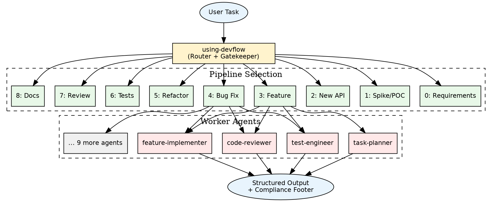
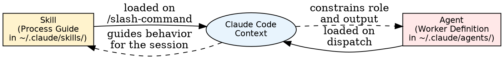
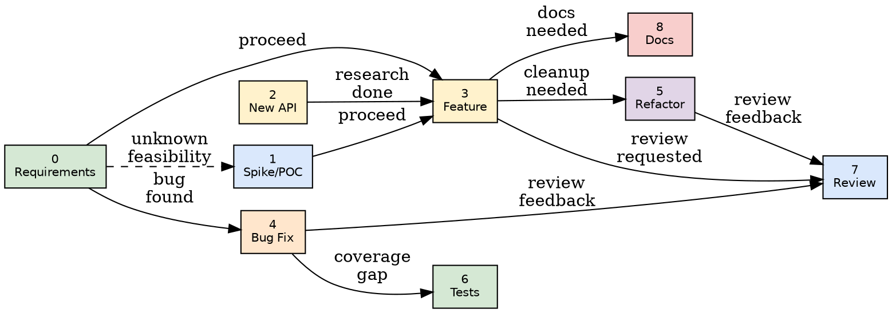
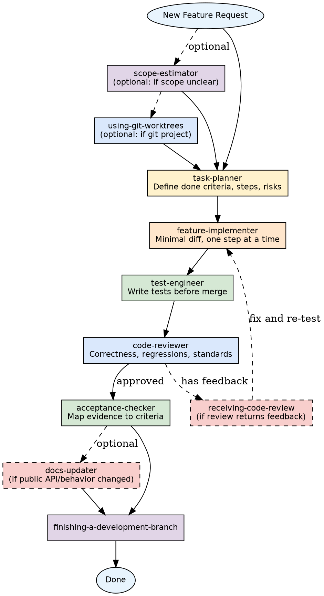
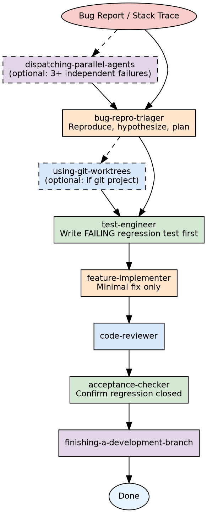
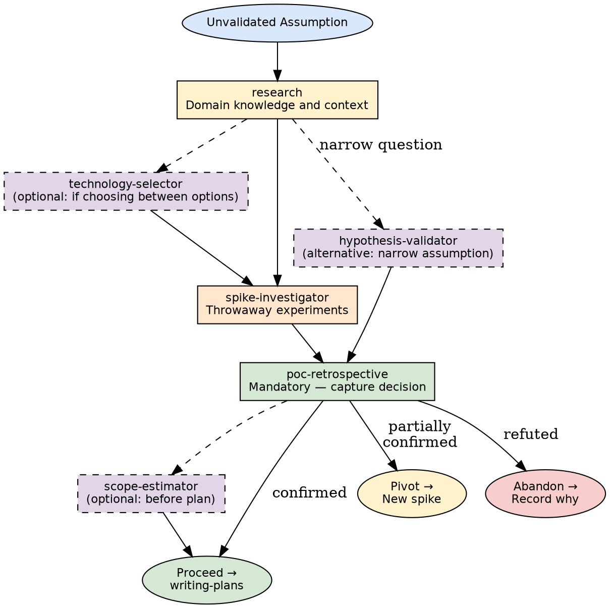

# Devflow User Manual

A practical guide to the Devflow framework — what it is, why it exists, how to install it, and how to get the most out of it.

---

## Table of Contents

1. [Why Devflow Exists](#1-why-devflow-exists)
2. [Core Concepts](#2-core-concepts)
3. [Framework Structure](#3-framework-structure)
4. [Architecture Overview](#4-architecture-overview)
5. [The Nine Pipelines](#5-the-nine-pipelines)
6. [Pipeline Flow Diagrams](#6-pipeline-flow-diagrams)
7. [Usage Examples](#7-usage-examples)
8. [Installation](#8-installation)
9. [Creating New Skills and Agents](#9-creating-new-skills-and-agents)
10. [Limitations](#10-limitations)
11. [Quick Reference](#11-quick-reference)

---

## 1. Why Devflow Exists

### The Problem

When you ask an AI assistant to help with software development, the default behavior is to start doing things immediately — writing code, proposing solutions, reviewing diffs — without first asking: *Is this the right approach? Have we understood the problem? What could go wrong?*

This produces several recurring failure modes:

- **Code written before requirements are understood** — builds the wrong thing
- **Fixes applied before the root cause is confirmed** — masks the real problem
- **Tests written after implementation** — proves nothing, catches nothing
- **Reviews that are rubber stamps** — performative agreement, no technical rigor
- **Work claimed complete without verification** — false confidence

Each of these failures is not a capability problem. The AI can do better. The problem is *discipline* — there is no structure forcing the right sequence of steps.

### The Solution

Devflow is a framework of **skills** and **worker agents** for Claude Code that enforces disciplined, sequenced software development workflows. It acts as a **router and gatekeeper**: before any code is written, any plan is made, or any review is given, the right worker for the job is selected and announced.

The result is that every task follows a proven pipeline — requirements before design, design before planning, planning before implementation, tests before merge, verification before completion claims.

### Who It Is For

- **Solo developers** using Claude Code who want consistent, high-quality AI assistance across sessions
- **Teams** who want to enforce shared development discipline through AI tooling
- **Anyone who has been burned** by AI assistants confidently doing the wrong thing

---

## 2. Core Concepts

### Skills

A **skill** is a reusable process guide stored in `~/.claude/skills/`. It is invoked via a slash command (e.g., `/using-devflow`, `/test-driven-development`). Skills define *how* to approach a category of work — the steps, the rules, the checks.

Skills are read into Claude's context when invoked. They constrain and guide behavior for that session.

### Agents

An **agent** is a worker definition stored in `~/.claude/agents/`. Each agent has a focused role, strict boundaries, and a defined output format. Agents are dispatched by skills to do specific work: plan, implement, test, review, document.

An agent knows what it **does** and — equally important — what it **does not** do. A `test-engineer` writes tests; it does not change production code. A `code-reviewer` critiques; it does not rewrite.

### The Router

`using-devflow` is the master routing skill. It must be invoked at the start of every task. It:

1. Reads the task description
2. Selects the correct **pipeline** (ordered sequence of agents)
3. Announces the pipeline and the first active agent
4. Enforces that no work begins before routing is complete

### Pipelines

A **pipeline** is an ordered sequence of workers matched to a task type. There are nine pipelines covering the full software development lifecycle:

```
0  Requirements gathering    → understand the problem first
1  Spike / POC investigation → validate before committing
2  Unfamiliar API/library    → research before building
3  New feature               → plan → build → test → review
4  Bug fix                   → reproduce → test → fix → verify
5  Refactor                  → plan → simplify → review
6  Test-only                 → add coverage without touching production
7  Review-only               → evaluate without implementing
8  Docs-only                 → document what shipped
```

### Worker Self-Identification

Every agent response begins with a three-line header:

```
Active agent: <agent name>
Purpose: <one sentence>
Scope: <what is in scope / out of scope>
```

And ends with:

```
Worker compliance: followed <agent-name> format
```

This makes compliance visible and auditable. You always know which worker is active and what it is responsible for.

---

## 3. Framework Structure

### Skills Catalog (21 skills)

| Category | Skill | Purpose |
|---|---|---|
| **Routing** | `using-devflow` | Master router — selects pipeline before any work begins |
| **Requirements** | `interview` | Structured questioning to produce a written spec |
| | `brainstorming` | Turns a spec into a concrete design through dialogue |
| **Investigation** | `spike-executor` | Orchestrates full spike/POC lifecycle |
| | `hypothesis-validator` | Minimal experiment to test one specific assumption |
| | `poc-retrospective` | Captures spike decision, learnings, carry-forwards |
| | `find-bugs` | Security and quality review of branch changes |
| **Planning** | `writing-plans` | Bite-sized, TDD-anchored implementation plans |
| | `executing-plans` | Runs a plan step-by-step with review checkpoints |
| **Implementation** | `test-driven-development` | RED-GREEN-REFACTOR cycle enforcement |
| | `code-simplifier` | Refines code clarity while preserving behavior |
| | `subagent-driven-development` | Parallel plan execution via independent subagents |
| | `dispatching-parallel-agents` | Parallelizes independent tasks across subagents |
| | `using-git-worktrees` | Isolated git worktree before implementation begins |
| **Review** | `requesting-code-review` | Verifies work meets requirements before merging |
| | `receiving-code-review` | Technical rigor when processing review feedback |
| | `verification-before-completion` | Evidence-based check before any completion claim |
| **Completion** | `finishing-a-development-branch` | Guides branch to merge, PR, or cleanup |
| **Documentation** | `session-continuity` | Snapshots work state for multi-session continuity |
| **Meta** | `writing-skills` | TDD-based approach to creating new skills |
| | `systematic-debugging` | Root-cause investigation before proposing fixes |

### Agents Catalog (13 agents)

| Agent | Role | Does Not |
|---|---|---|
| `task-planner` | Translates tasks into minimal, executable plans | Write production code |
| `feature-implementer` | Implements one scoped step with minimal diff | Refactor, review, or do unrelated cleanup |
| `test-engineer` | Writes/updates tests, regression coverage | Change production code (except for testability) |
| `code-reviewer` | Critiques correctness, regressions, standards | Rewrite implementation |
| `acceptance-checker` | Maps implementation to acceptance criteria | Invent missing evidence |
| `docs-updater` | Updates docs/changelog for recent changes | Invent undocumented behavior |
| `api-researcher` | Researches external APIs/libraries | Implement production code |
| `bug-repro-triager` | Produces repro steps, hypotheses, investigation plan | Implement fix |
| `code-simplification` | Simplifies recently modified code | Alter functionality or broaden scope |
| `research` | General-purpose technical research | Write production code |
| `spike-investigator` | Hands-on throwaway experimentation | Write production-ready code or enforce TDD |
| `technology-selector` | Evaluates options, produces single recommendation | Implement the chosen technology |
| `scope-estimator` | Rough effort/complexity sizing with confidence levels | Write implementation plans or make arch decisions |

---

## 4. Architecture Overview

### How a Task Flows Through Devflow



### Skill vs. Agent Relationship



---

## 5. The Nine Pipelines

Each pipeline maps a task type to an ordered sequence of workers. Workers are selected, announced, and executed in sequence. The router always makes the pipeline visible before work begins.

---

### Pipeline 0 — Requirements Gathering

**Use when:** The task is vague, requirements are not written down, or you cannot determine which implementation pipeline applies.

**Default pipeline:**
```
interview → brainstorming → scope-estimator → writing-plans
```

**Key rules:**
- No code is written in this pipeline — the output is a spec and a plan
- `interview` extracts requirements; `brainstorming` turns them into a design
- `scope-estimator` gates the proceed decision: if estimate is XL or confidence is Low, split the work first

**Exit transitions:**
- Scope is manageable → `writing-plans`, then Pipeline 3 or 4
- Key assumption unvalidated → Pipeline 1 (Spike)
- Scope too large → split into multiple plans, each routed independently

---

### Pipeline 1 — Spike / POC Investigation

**Use when:** A technical idea needs feasibility validation before committing to a plan, or a key assumption is unvalidated.

**Default pipeline:**
```
research → spike-investigator → poc-retrospective
```

**Key rules:**
- `spike-investigator` works in throwaway mode — no TDD, no production standards
- `poc-retrospective` is **mandatory** — never close a spike without capturing the decision
- Use `session-continuity` at session boundaries

**Exit transitions:**
- Proceed → `writing-plans` for production implementation
- Pivot → new spike with refined hypothesis
- Abandon → `poc-retrospective` closes the record

---

### Pipeline 2 — Unfamiliar API / Library / Framework

**Use when:** Integrating something not previously used in the project, or when version differences may affect the approach.

**Default pipeline:**
```
api-researcher → task-planner → feature-implementer → test-engineer → code-reviewer
```

**Key rules:**
- `api-researcher` must produce actionable findings before `task-planner` begins
- `feature-implementer` cannot start until research findings are incorporated

---

### Pipeline 3 — New Feature / Behavior Change

**Use when:** Adding new user-visible behavior, changing existing behavior, or extending a public API.

**Default pipeline:**
```
task-planner → feature-implementer → test-engineer → code-reviewer → acceptance-checker
```

**Key rules:**
- `task-planner` defines done criteria first
- `test-engineer` writes tests before the branch is merged, not after
- `acceptance-checker` maps evidence to stated criteria — it does not invent missing evidence

---

### Pipeline 4 — Bug Fix / Runtime Failure

**Use when:** A defect or runtime failure needs investigation and a targeted fix.

**Default pipeline:**
```
bug-repro-triager → test-engineer → feature-implementer → code-reviewer → acceptance-checker
```

**Key rules:**
- Reproduce first — no fix before failure is confirmed
- `test-engineer` writes a failing regression test before `feature-implementer` applies the fix
- Fix is minimal only — no unrelated cleanup or refactoring

---

### Pipeline 5 — Refactor / Simplification

**Use when:** Code structure needs improvement without changing external behavior.

**Default pipeline:**
```
task-planner → code-simplifier → code-reviewer → acceptance-checker
```

**Key rules:**
- `code-simplifier` must not alter external behavior
- `acceptance-checker` confirms behavior is preserved — not improved or extended

---

### Pipeline 6 — Test-Only

**Use when:** Coverage gaps need to be filled without changing production code.

**Default pipeline:**
```
test-engineer → code-reviewer
```

**Key rules:**
- `test-engineer` must not modify production code unless absolutely necessary for testability
- `code-reviewer` is required for complex or shared test infrastructure changes

---

### Pipeline 7 — Review-Only

**Use when:** An explicit review of existing code or a pull request is requested, with no implementation change intended.

**Default pipeline:**
```
code-reviewer
```

**Key rules:**
- State the review scope before `code-reviewer` begins
- `code-reviewer` critiques — it does not rewrite unless explicitly asked

---

### Pipeline 8 — Docs-Only

**Use when:** Documentation needs updating after a code change, or a README/changelog is out of date.

**Default pipeline:**
```
docs-updater
```

**Key rules:**
- `docs-updater` must not invent undocumented behavior
- Scope docs updates to changes that actually landed

---

## 6. Pipeline Flow Diagrams

### Full Lifecycle Flow



### Pipeline 3 — Feature Build (Detailed)



### Pipeline 4 — Bug Fix (Detailed)



### Spike / POC Investigation (Pipeline 1)



---

## 7. Usage Examples

### Example 1: "I have an idea for a new feature"

The task is vague — requirements are not written down.

**What Devflow does:**

```
Selected worker agents: interview → brainstorming → scope-estimator → writing-plans
Reason: requirements undefined — spec and design must be established before any planning or coding (pipeline 0)
Current agent: interview
```

`interview` asks questions one at a time to produce a written spec. `brainstorming` turns it into a concrete design. `scope-estimator` checks if the scope is manageable. `writing-plans` produces the implementation plan.

---

### Example 2: "Fix this stack trace"

A bug report with a stack trace.

**What Devflow does:**

```
Selected worker agents: bug-repro-triager → test-engineer → feature-implementer → code-reviewer → acceptance-checker
Reason: runtime failure — reproduce and regression-cover before fixing (pipeline 4)
Current agent: bug-repro-triager
```

`bug-repro-triager` confirms the reproduction steps and root cause hypothesis. `test-engineer` writes a failing regression test. `feature-implementer` applies the minimal fix. `code-reviewer` checks correctness. `acceptance-checker` confirms the regression is closed.

**Critical discipline enforced:** The fix is never applied before the failure is reproduced and a test is written.

---

### Example 3: "We're integrating Stripe for the first time"

Unfamiliar external API.

**What Devflow does:**

```
Selected worker agents: api-researcher → task-planner → feature-implementer → test-engineer → code-reviewer
Reason: unfamiliar external API — research before planning (pipeline 2)
Current agent: api-researcher
```

`api-researcher` reads Stripe's documentation, identifies relevant endpoints, authentication patterns, and gotchas. `task-planner` incorporates those findings into a plan before any code is written.

---

### Example 4: "Can you clean up this module — it's gotten messy"

Refactor request.

**What Devflow does:**

```
Selected worker agents: task-planner → code-simplifier → code-reviewer → acceptance-checker
Reason: code structure improvement without behavior change (pipeline 5)
Current agent: task-planner
```

`task-planner` defines what "clean" means and what must not change. `code-simplifier` refines the code. `acceptance-checker` confirms behavior is preserved — not improved or extended.

---

### Example 5: "Should we use Redis or Memcached for caching?"

Technology decision with multiple options.

**What Devflow does:**

```
Selected worker agents: research → technology-selector
Reason: technology choice between named options — evaluate before deciding (pipeline 1 variant)
Current agent: research
```

`research` gathers context on both options. `technology-selector` evaluates 2–4 options against the stated requirements and produces a single recommendation with trade-offs — it does not implement the chosen technology.

---

### Example 6: "Three test files are failing in unrelated subsystems"

Multiple independent failures.

**What Devflow does:**

```
Selected worker agents: dispatching-parallel-agents → bug-repro-triager (×3) → test-engineer → feature-implementer → code-reviewer
Reason: 3 independent failures in different subsystems — parallel dispatch saves time (pipeline 4 + parallel variant)
Current agent: dispatching-parallel-agents
```

One `bug-repro-triager` agent per failure domain runs simultaneously instead of sequentially.

---

## 8. Installation

### Prerequisites

- [Claude Code](https://docs.anthropic.com/en/docs/claude-code) installed and configured
- Bash or a compatible shell

### Step 1: Copy Skills

```bash
cp -r skills/* ~/.claude/skills/
```

### Step 2: Copy Agents

```bash
cp -r agents/* ~/.claude/agents/
```

### Step 3: Configure the Router

Add the routing instruction to your `~/.claude/CLAUDE.md` (create it if it does not exist):

```markdown
For EVERY task — no exceptions — invoke the `using-devflow` skill before doing any work.
```

This single line is what activates Devflow. Without it, Claude Code will not automatically apply the router.

### Step 4: Verify

Start a new Claude Code session and give a task. You should see the routing announcement before any work begins:

```
Selected worker agents: ...
Reason: ...
Current agent: ...
```

If you do not see this, check that `~/.claude/CLAUDE.md` contains the routing instruction and that the skills directory is correctly populated.

### Optional: Project-Specific Configuration

You can add a `CLAUDE.md` in any project directory to enable Devflow for that project specifically:

```markdown
For EVERY task — no exceptions — invoke the `using-devflow` skill before doing any work.
```

This scopes Devflow to that project without affecting global behavior.

---

## 9. Creating New Skills and Agents

### Creating a New Skill

Devflow uses **Test-Driven Development for skills** (via `writing-skills`). The process mirrors RED-GREEN-REFACTOR:

1. **RED** — Write a pressure test: a scenario where an agent violates the rule you want to enforce, before the skill exists. Document the exact rationalization it uses to skip the discipline.
2. **GREEN** — Write the skill (`SKILL.md`) that addresses those specific violations. Keep it minimal.
3. **REFACTOR** — Run the test again. Find new rationalizations. Close the loopholes. Repeat until the agent consistently complies.

**Skill file structure:**

```
~/.claude/skills/<skill-name>/SKILL.md
```

**Required frontmatter:**

```yaml
---
name: skill-name
description: One sentence — when to use and what it does (used for routing decisions)
framework: devflow
---
```

**Required sections:**

- `## When to Use` — specific trigger conditions
- `## When NOT to Use` — explicit exclusions
- Core process / rules
- `## Related Skills and Agents` — cross-references

**Key principle:** The `description` field in the frontmatter is what Claude reads when deciding whether to invoke the skill. Write it as a precise trigger condition, not a marketing sentence.

### Creating a New Agent

**Agent file structure:**

```
~/.claude/agents/<agent-name>.agent.md
```

**Required frontmatter:**

```yaml
---
name: agent-name
description: Focused role description
framework: devflow
model: claude-opus-4-7
tools: Read, Edit, Write, Bash, Glob, Grep
---
```

**Required sections:**

- Brief role statement (2–3 sentences)
- `## Capabilities` — what the agent can do
- `## Boundaries` — explicit "does not" constraints
- `## Output Format` — the structured output schema the agent must follow
- `## <Agent-Name> Rules` — behavioral rules, numbered

**Key design rules:**

- Every agent must have a **compliance footer**: `Worker compliance: followed <agent-name> format`
- Every agent must have **explicit boundaries** — what it does not do is as important as what it does
- Output format must be **machine-readable** — use structured headers, not prose paragraphs
- Keep agents **narrowly scoped** — an agent that does one thing well is more reliable than one that does several things adequately

### Registering a New Worker in the Router

After creating the agent, add it to `using-devflow/SKILL.md`:

1. Add a row to the **Worker Roles and Boundaries** table
2. Add it to the relevant **pipeline(s)** as either a default step or a Variant
3. Add it to the **Skill Priority** section if it introduces a new priority tier

---

## 10. Limitations

### What Devflow Does Not Do

**It does not enforce tool use directly.** Devflow is a behavioral framework — it guides what Claude does, not what tools it can access. Permission boundaries are set separately in Claude Code settings.

**It does not guarantee output quality.** Devflow enforces the right sequence of steps and the right worker for each step. It cannot guarantee that a `feature-implementer` writes good code, only that it follows the TDD cycle and stays within scope.

**It does not cover all task types.** The nine pipelines cover common software development scenarios. Highly specialized tasks (hardware integration, data science pipelines, legal document review) may not map cleanly to any pipeline. In those cases, use the closest matching pipeline or route to `none` and proceed normally.

**It does not replace human review.** Devflow's `code-reviewer` and `acceptance-checker` agents are useful checks, but they are not a substitute for human judgment on critical changes.

**It does not manage long context automatically.** For very long sessions, use `session-continuity` manually at session boundaries to preserve state.

**Agents are role-constrained, not capability-constrained.** A `test-engineer` can technically read production code, but its role definition tells it not to change it. Role discipline depends on the model following the agent's boundaries — it is a soft constraint, not a hard one.

### Known Friction Points

**Overhead on small tasks.** For a one-line typo fix, routing through `task-planner → feature-implementer → code-reviewer` adds friction. Use Pipeline 7 (Review-only) or route to `none` for genuinely trivial changes.

**Pipeline selection is not always obvious.** Some tasks genuinely span pipelines (e.g., a feature that also fixes a latent bug). When in doubt, route to the pipeline that matches the *primary* intent and add agents from the secondary pipeline as Variants.

**Session context limits.** Devflow loads skill content into context when invoked. In very long sessions with many skills active, this consumes context tokens. Prioritize loading only the skills relevant to the current pipeline.

---

## 11. Quick Reference

### Pipeline Selection Cheatsheet

| Task description | Pipeline |
|---|---|
| "I have an idea" / "What should we build?" | 0 — Requirements |
| "Can we do X with library Y?" / "Which approach is better?" | 1 — Spike/POC |
| "We're using [new library] for the first time" | 2 — Unfamiliar API |
| "Add feature X" / "Change behavior of Y" | 3 — Feature |
| "Fix this bug" / "This is crashing" / "Stack trace" | 4 — Bug fix |
| "Clean this up" / "Simplify" / "Reduce complexity" | 5 — Refactor |
| "Add tests for X" / "Coverage is too low" | 6 — Test-only |
| "Review this" / "Check this diff" | 7 — Review-only |
| "Update the README" / "Write changelog entry" | 8 — Docs-only |

### Routing Announcement Format

```
Selected worker agents: <worker1> → <worker2> → <worker3>
Reason: <why this pipeline>
Current agent: <first worker>
```

### Worker Response Format

```
Active agent: <agent name>
Purpose: <one sentence>
Scope: <in scope / out of scope>

[... structured output ...]

Worker compliance: followed <agent-name> format
Current agent: <next agent>    ← only if pipeline continues
```

### Discipline Checklist

Before claiming a task is complete:

- [ ] Was routing announced before any work began?
- [ ] Did each worker stay in its defined role?
- [ ] Was a failing test written before any fix was applied?
- [ ] Was the fix verified (not just written)?
- [ ] Did `acceptance-checker` map evidence to stated criteria?
- [ ] Was `poc-retrospective` written before closing any spike?
- [ ] Was `session-continuity` used at session boundaries for long work?

### Key Rules Summary

| Rule | Why |
|---|---|
| Route before any work | Without routing, there is no discipline — just speed |
| Reproduce before fixing | Fixes without repro mask the real problem |
| Test before implementing | Tests-after prove nothing; tests-first catch bugs |
| Verify before completing | Evidence before claims — always |
| Retrospective before closing spike | Memory fades; decisions must be recorded |
| One worker at a time | Mixed roles produce muddled outputs |
| Minimal diff | Broader scope = harder review = more bugs |
